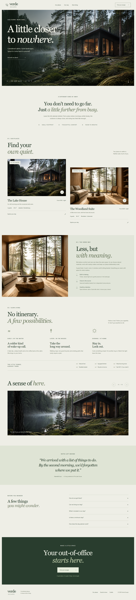
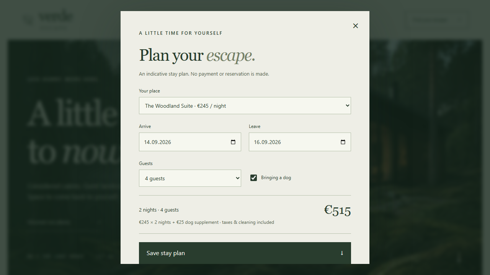
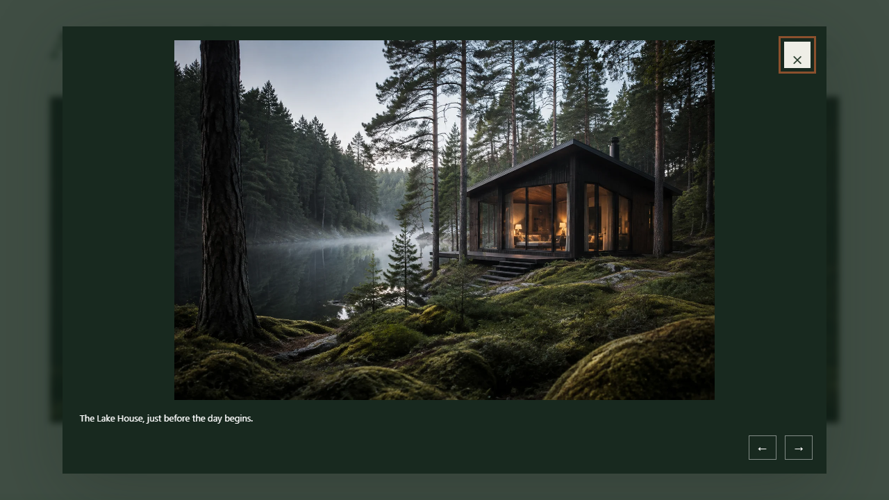
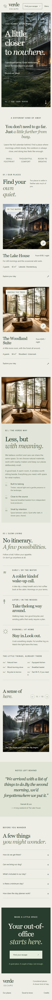

# Verde Escape

A considered cabin retreat experience, combining quiet architectural storytelling with an interactive, transparent stay planner.

## Key features

- Cinematic original local imagery, two cabin profiles and a hospitality identity.
- Stay planner validates calendar dates, two-night minimum, 21-night maximum, capacity and pet policies.
- Itemised indicative prices, including the pet supplement, and downloadable stay plans.
- Keyboard-operable lightbox and gallery; native FAQ disclosures.
- Responsive navigation, low-amplitude parallax and reveals with reduced-motion support.

## Technology

HTML5, CSS, vanilla JavaScript, Vite, ESLint, Prettier and Playwright.

## Local development

Requires Node.js 24 and npm.

~~~bash
npm ci
npm run dev
~~~

Open the local URL printed by Vite. There are no demo accounts or runtime secrets for this frontend-only project.

## Configuration

See .env.example. BASE_PATH is passed as an environment variable to Vite. Local builds default to ./ so assets remain relative. Repository Pages builds use /prfio-verde-escape/.

~~~bash
npm run lint
npm run build
npm run preview
~~~

## Testing

~~~bash
npx playwright install chromium
npm test
~~~

Playwright starts a server on port 5192 and checks interactions, validation responsive layouts and automated axe accessibility checks. Captures go to docs/screenshots. See [QA.md](QA.md) for execution evidence. CI runs the suite before publishing.

## Deployment

The included GitHub Actions workflow validates, builds with the repository base path, uploads dist and deploys through GitHub Pages. Set **Settings → Pages → Source → GitHub Actions**, then push main or run the workflow manually. No live URL is claimed until publication succeeds.

~~~bash
gh auth login
gh repo create prfio-verde-escape --public --source=. --remote=origin --push
gh api --method POST repos/{owner}/prfio-verde-escape/pages -f build_type=workflow
gh workflow run pages.yml
~~~

Replace {owner} with your GitHub login. If a remote exists, inspect it first; never force-push unrelated history. Description and topics are in .github/repository.json.

## Architecture and structure

~~~text
src/                 Application logic, styles and local data
public/              Local media, icons and credits page
index.html           Entry document
vite.config.js       Build and repository base configuration
tests/               Browser and domain checks
docs/screenshots/    Running application captures
.github/workflows/   Validation and Pages deployment
~~~

Product-specific modules own UI behaviour. Static media stays local. main.js owns navigation and interaction orchestration. booking.js isolates date, capacity and price validation from the DOM.

## Scope and limits

The planner is explicitly an interactive booking demonstration: it does not query inventory, take payments or confirm reservations. Cabin imagery depicts imagined places. UTC calendar arithmetic avoids daylight-saving errors.

## Design and credits

[DESIGN.md](DESIGN.md) records the visual system. [CREDITS.md](CREDITS.md) records research, media and icon provenance. MIT-licensed source; dependencies retain their original licences.
